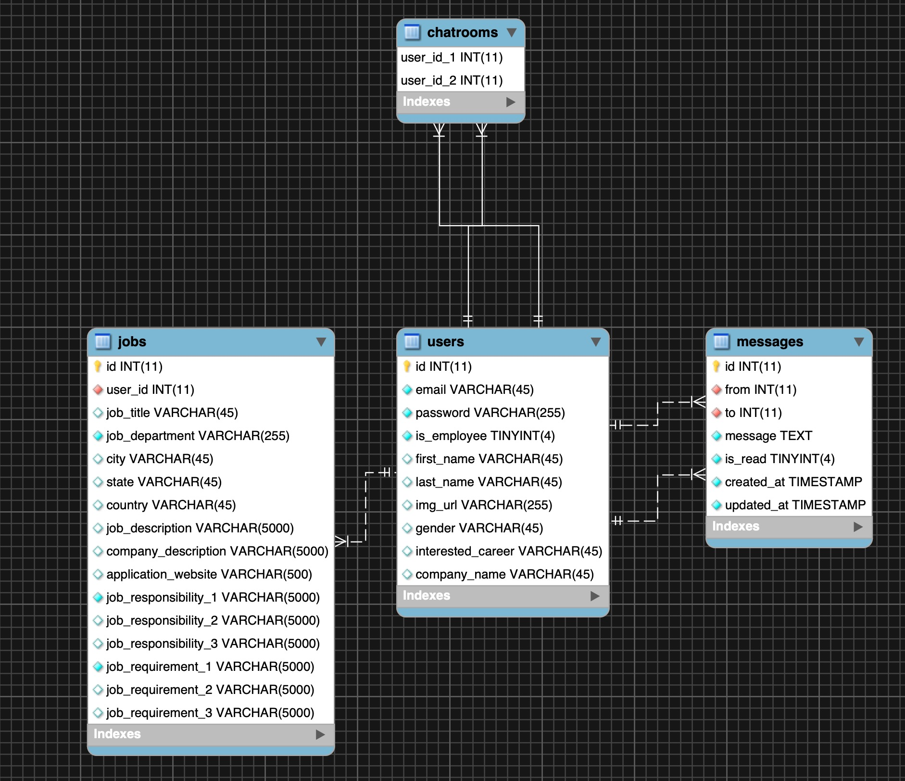

# Final project - Shuaiqing Luo

## Deployment Url
I intended to deploy my project on cPanel. However, the data center of the hosting company of my server breaks down on 5/3 and they were still fixing the problem. I have told Professor Tang about this, and I will deploy it on the cPanel once the server recovers. He told me that if the server could not recover by the time my project was being graded, he would use my youtube video for the grading.

I really appreciate your understanding!

## Sign Up
I intended to use the email verification code for signup. However, my server breaks down so I could not send the email. Please just assume the verification you get from the email is 'joinmenow'

## Latest Branch
The most updated branch is "release". Please feel free to checkout to this branch if you would like to clone my project locally.

## Schema Picture

